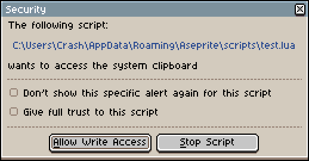

## app.clipboard

A set of functions to handle the clipboard. 

When calling a function with clipboard write access in a script, Aseprite will ask the user if they want to allow the function to run or stop the script. 



## app.clipboard.text

```lua
local text = app.clipboard.text
```

Gets or sets the clipboard text. Returns `nil` if there is no text.

## app.clipboard.image

```lua
local image = app.clipboard.image
```

Gets or sets the clipboard [image](image.md#image). Returns `nil` if there is no image.

## app.clipboard.content

```lua
local content = app.clipboard.content
```

Gets the content of the clipboard, as a table. Values:

* `image`: An [image](image.md#image) object or `nil`
* `selection`: A [selection](selection.md#selection) object or `nil`
* `palette`: A [palette](palette.md#palette) object or `nil` 
* `tileset`: A [tileset](tileset.md#tileset) object or `nil` 
* `text`: A string or `nil` 

Depending on what is copied, each value will be set differently. Case table:

|             |An image is copied in Aseprite      |An image is copied externally|Text is copied|A portion of the Palette is copied                       |
|-------------|------------------------------------|-----------------------------|--------------|---------------------------------------------------------|
|`image`    |[Image](image.md#image)             |[Image](image.md#image)      |`nil`         |`nil`                                                    |
|`selection`|[Selection](selection.md#selection) |`nil`                        |`nil`         |`nil`                                                    |
|`palette`  |Sprite [palette](palette.md#palette)|`nil`                        |`nil`         |`nil`                                                    |
|`tileset`  |`nil`                               |`nil`                        |`nil`         |`nil`                                                    |
|`text`     |`nil`                               |`nil`                        |String        |String of selected colors in hex codes, seperated by `\n`|

## app.clipboard.hasText

```lua
local hasText = app.clipboard.hasText
```

Returns true if the last item copied to the clipboard was text.

## app.clipboard.hasImage

```lua
local hasImage = app.clipboard.hasImage
```

Returns true if the last item copied to the clipboard was an [image](image.md#image).

## app.clipboard.clear()

```lua
app.clipboard.clear()
```

Clears the clipboard.