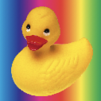
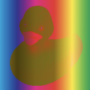

# BlendMode

Blend modes defines how the colors should be mixed when two images overlaps. Used in [Image:drawImage()](image.md#imagedrawimage) as input argument.

Background sample // sample with blending applied

## BlendMode.NORMAL

Mix the background colors with the blending image proportionally to its alpha values. Full transparent pixels will show the background.

## BlendMode.SRC

A simple copy/paste of the blending image to the background.

## BlendMode.MULTIPLY

## BlendMode.SCREEN

## BlendMode.OVERLAY

## BlendMode.DARKEN

## BlendMode.LIGHTEN

## BlendMode.COLOR_DODGE

## BlendMode.COLOR_BURN

## BlendMode.HARD_LIGHT

## BlendMode.SOFT_LIGHT

## BlendMode.DIFFERENCE

## BlendMode.EXCLUSION

## BlendMode.HSL_HUE

## BlendMode.HSL_SATURATION

## BlendMode.HSL_COLOR

## BlendMode.HSL_LUMINOSITY

## BlendMode.ADDITION

## BlendMode.SUBTRACT

## BlendMode.DIVIDE

