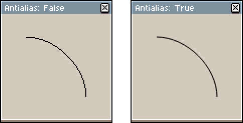
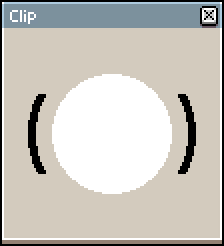
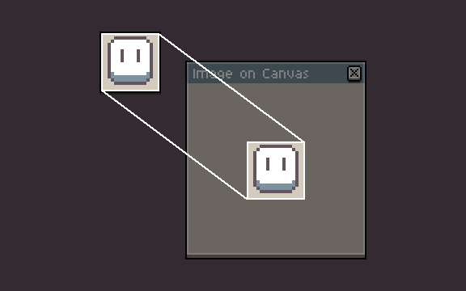
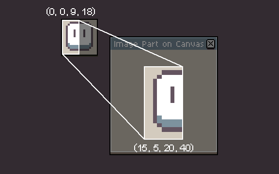
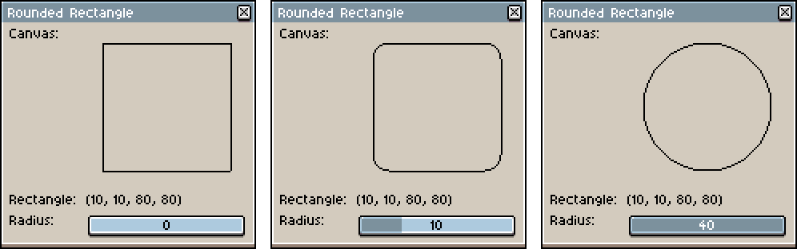
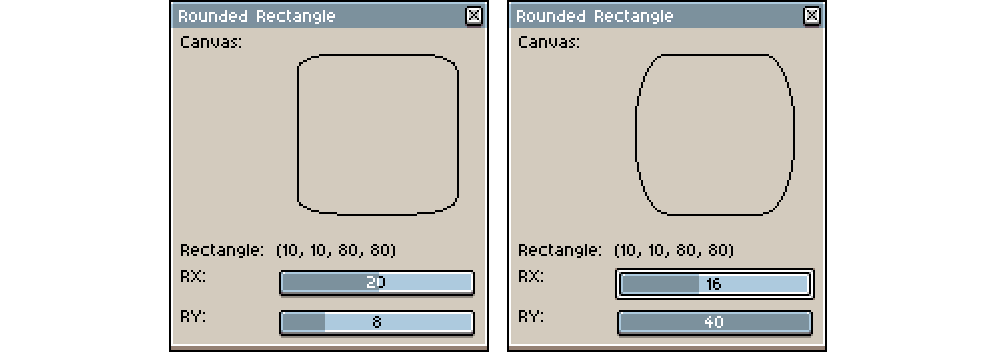

# GraphicsContext

The *GraphicsContext* object provides methods for drawing images, text and shapes on the canvas.

```lua
local dlg = Dialog()
dlg:canvas{
  onpaint = function(ev)
    local gc = ev.context
    -- gc is a GraphicsContext
  end
}
```

## GraphicsContext.width

```lua
local width = gc.width
```

Gets the width of the visible area in pixels. Canvas dimensions change when the dialog is resized by the user.

## GraphicsContext.height

```lua
local height = gc.height
```

Gets the height of the visible area in pixels. Canvas dimensions change when the dialog is resized by the user.

## GraphicsContext.antialias

```lua
local aa = gc.antialias
gc.antialias = true
```

Gets or sets whether paths and shapes are painted on using antialiasing.



## GraphicsContext.color

```lua
local color = gc.color
gc.color = Color(255)
```

Gets or sets the [color](color.md#color) to paint with the path functions.

## GraphicsContext.strokeWidth

```lua
local sw = gc.strokeWidth
gc.strokeWidth = 10
```

Gets or sets the width of lines painted when calling [GraphicsContext:stroke()](#graphicscontextstroke) or [GraphicsContext:strokeRect()](#graphicscontextstrokerect).

## GraphicsContext.blendMode

```lua
local bm = gc.blendMode
gc.blendMode = BlendMode.NORMAL
```

[Blend mode](blendmode.md#blendmode) used in [stroke()](#graphicscontextstroke),
[fill()]((#graphicscontextfill)), [drawImage()](#graphicscontextdrawimage), etc.

## GraphicsContext.opacity

```lua
local opacity = gc.opacity
assert(opacity >= 0 and opacity <= 255)
gc.opacity = newOpacity
```

Opacity used in [stroke()](#graphicscontextstroke),
[fill()]((#graphicscontextfill)), [drawImage()](#graphicscontextdrawimage), etc.

* `opacity`: 0 completelly transparenty, 255 completelly opaque.

## GraphicsContext.theme

It has the same functionality as [app.theme](app_theme.md#apptheme), with the only difference that the values returned
by accessing dimensions or style metrics data are not affected by the current UI Scale setting. This is useful when you
are drawing on a dialog canvas's GraphicsContext with [autoScaling](dialog.md#dialogcanvas) enabled, so you don't have to worry about adjusting sizes and measures when painting on the canvas using the current theme.

For instance, when UI Scale is set to 200% this is the difference:
```lua
local dlg = Dialog()
dlg:canvas{
  onpaint = function(ev)
      local b1 = app.theme:styleMetrics("button")
      local b2 = ev.context.theme:styleMetrics("button")
      print("app.theme:     " .. b1.border.top .. " " .. b1.border.left .. " " .. b1.border.bottom .. " " .. b1.border.right)
      print("context.theme: " .. b2.border.top .. " " .. b2.border.left .. " " .. b2.border.bottom .. " " .. b2.border.right)
      -- Console's output:
      -- app.theme:     8 8 12 8
      -- context.theme: 4 4 6 4
  end
}
```

## GraphicsContext:save()

```lua
gc:save()
```

Saves the current state of the canvas to [restore](#graphicscontextrestore) it later, including:

* [color](#graphicscontextcolor)
* [opacity](#graphicscontextopacity)
* [blendMode](#graphicscontextblendmode)
* [stroke width](#graphicscontextstrokewidth)
* [clipping region](#graphicscontextclip)

## GraphicsContext:restore()

```lua
gc:restore()
```

Restores the last [saved](#graphicscontextsave) canvas state.

## GraphicsContext:clip()

```lua
gc:clip()
```

Sets the [current path](#graphicscontextbeginpath) as a clipping area for following drawing operations.

**Warning:** The only option to draw paths not clipped after calling `GraphicsContext:clip()` is [restoring](#graphicscontextrestore) a previously saved state.

```lua
-- Save state before clipping
gc:save()

-- Create a rectangle and use it as a clipping region
gc:beginPath()
gc:rect(Rectangle(0, 30, 100, 40))
gc:clip()

-- Stroke a circle with width of 4
gc.strokeWidth = 4

gc:beginPath()
gc:roundedRect(Rectangle(10, 10, 80, 80), 50)
gc:stroke()

-- Restore the state
gc:restore()

-- Fill a smaller circle in white
gc.color = Color {r = 255, g = 255, b = 255, a = 255}

gc:beginPath()
gc:roundedRect(Rectangle(20, 20, 60, 60), 30)
gc:fill()
```



## GraphicsContext:strokeRect()

```lua
gc:strokeRect(rectangle)
```

Paints the edges of the given [rectangle](rectangle.md#rectangle) with
the [current color](#graphicscontextcolor) and [current width](#graphicscontextstrokewidth).

## GraphicsContext:fillRect()

```lua
gc:fillRect(rectangle)
```

Fills the given [rectangle](rectangle.md#rectangle) with the
[current color](#graphicscontextcolor).

## GraphicsContext:fillText()

```lua
gc:fillText(string, x, y)
```

Draws on the canvas the given text string, at a position specified by the *xy*-coordinates.

## GraphicsContext:measureText()

```lua
local size = gc:measureText(string)
```

Returns the [size](size.md#size) of the given text using the current font.

## GraphicsContext:drawImage()

```lua
gc:drawImage(image, x, y)
gc:drawImage(image, srcRect, dstRect)
gc:drawImage(image, srcX, srcY, srcW, srcH, dstX, dstY, dstW, dstH)
```

Draws on the canvas the given image.

If given *xy*-coordinates, the full image will be drawn at the specified position, in it's original scale.



If given source and destination [bounds](rectangle.md) (or their respective values), a part of the image is drawn (specified by the *srcRect*, or *srcX/srcY/srcW/srcH*, relative to the image) on the canvas (specified by the *dstRect* or *dstX/dstY/dstW/dstH*). This allows drawing only a part of and/or scaling the image.



## GraphicsContext:drawThemeImage()

```lua
gc:drawThemeImage(partId, point)
gc:drawThemeImage(partId, x, y)
```

Draws on the canvas a theme part specified by the given *partId*, at a given [Point](point.md) or at specified *xy*-coordinates.

List of possible parts can be found in [theme.xml](https://github.com/aseprite/aseprite/blob/3c77928a6f193748bcd8cca15d45000dd58e11d5/data/extensions/aseprite-theme/theme.xml#L115).

## GraphicsContext:drawThemeRect()

```lua
gc:drawThemeRect(partId, rectangle)
gc:drawThemeRect(partId, x, y, w, h)
```

Draws on the canvas a theme part specified by the given *partId*, filling a given [Rectangle](rectangle.md) or at specified *xy*-coordinates, with given width and height. This method uses [nine-slice scaling](https://en.wikipedia.org/wiki/9-slice_scaling) for parts that have their [Slice's center](slice.md#slicecenter) defined.

List of possible parts can be found in [theme.xml](https://github.com/aseprite/aseprite/blob/3c77928a6f193748bcd8cca15d45000dd58e11d5/data/extensions/aseprite-theme/theme.xml#L115).

## GraphicsContext:beginPath()

```lua
gc:beginPath()
```

Starts a new path, emptying the list of tracked sub-paths. This is the first method to call when drawing paths.

## GraphicsContext:closePath()

```lua
gc:closePath()
```

Closes the current sub-path by connecting the current point with the first point of the current sub-path.

## GraphicsContext:moveTo()

```lua
gc:moveTo(x, y)
```

Starts a new sub-path at the specified *xy*-coordinates. This is the second method to call (after [GraphicsContext:beginPath()](#graphicscontextbeginpath)) when drawing paths.

## GraphicsContext:lineTo()

```lua
gc:lineTo(x, y)
```

Adds a line to the current sub-path, from the last point to the specified *xy*-coordinates.

**Note:** This method doesn't draw on the canvas, to draw the path onto the canvas call [GraphicsContext:stroke()](#graphicscontextstroke) or [GraphicsContext:fill()](#graphicscontextfill).

## GraphicsContext:cubicTo()

```lua
gc:cubicTo(cp1x, cp1y, cp2x, cp2y, x, y)
```

Adds a cubic [Bézier curve](https://en.wikipedia.org/wiki/B%C3%A9zier_curve) to the current sub-path, from the last point to the specified *xy*-coordinates, with two control points (specified by *cp1x/cp1y* and *cp2x/cp2y* coordinates).

**Note:** This method doesn't draw on the canvas, to draw the path onto the canvas call [GraphicsContext:stroke()](#graphicscontextstroke) or [GraphicsContext:fill()](#graphicscontextfill).

## GraphicsContext:oval()

```lua
gc:oval(rectangle)
```

Adds an oval enclosed by the given [Rectangle](rectangle.md) to the current sub-path.

**Note:** This method doesn't draw on the canvas, to draw the path onto the canvas call [GraphicsContext:stroke()](#graphicscontextstroke) or [GraphicsContext:fill()](#graphicscontextfill).

## GraphicsContext:rect()

```lua
gc:rect(rectangle)
```

Adds a given [Rectangle](rectangle.md) to the current sub-path.

**Note:** This method doesn't draw on the canvas, to draw the path onto the canvas call [GraphicsContext:stroke()](#graphicscontextstroke) or [GraphicsContext:fill()](#graphicscontextfill).

## GraphicsContext:roundedRect()

```lua
gc:roundedRect(rectangle, r)
gc:roundedRect(rectangle, rx, ry)
```

Adds a given [Rectangle](rectangle.md) to the current sub-path with rounded corners.

If a single radius is specified, a rectangle with circular corners is created. This method can be used to easily draw circles.



If two radii are specified, a rectangle with elliptical corners is created.



**Note:** This method doesn't draw on the canvas, to draw the path onto the canvas call [GraphicsContext:stroke()](#graphicscontextstroke) or [GraphicsContext:fill()](#graphicscontextfill).

## GraphicsContext:stroke()

```lua
gc:stroke()
```

Paints the edges of the [current path](#graphicscontextbeginpath) with
the [current color](#graphicscontextcolor) and [current width](#graphicscontextstrokewidth).

## GraphicsContext:fill()

```lua
gc:fill()
```

Fills the [current path](#graphicscontextbeginpath) with the [current
color](#graphicscontextcolor).
