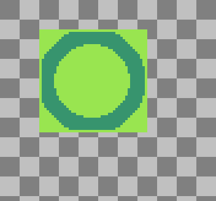

# Image

An image object. Each [cel](https://www.aseprite.org/docs/cel/) has
one image (all [linked cels](https://www.aseprite.org/docs/linked-cels/)
share the same image).

An image can be associated to a specific cel or can be alone:

* When you create an image with `Image()`, the image will be alone so
  they don't generate undo information.
* A [Cel.image](cel.md#celimage) is an image associated to a cel, some
  functions will generate undoable actions.

## Image()

```lua
local image = Image(width, height [, colorMode])
local image = Image(spec)
local image = Image(sprite)
local image = Image(otherImage)
local image = Image(otherImage, rectangle)
local image = Image{ fromFile=filename }
```

Creates a new image with the given `width` and `height`. The
[color mode](colormode.md#colormode) is optional, [RGB](colormode.md#colormodergb)
by default.

The `spec` parameter is an [image specification](imagespec.md#imagespec) object.

If you specify `otherImage`, it's equivalent to use
[`otherImage:clone()`](#imageclone). If you specify `Image(otherImage, rectangle)`
this will create a copy of the specified
[rectangle](rectangle.md#rectangle) of `otherImage`. `Image(otherImage, rectangle)`
may return `nil` if the [rectangle](rectangle.md#rectangle) is empty
(i.e., if its width and/or height are equal to or less than zero).

If a `sprite` is given, the image will be a render of the first frame
of the [sprite](sprite.md#sprite). Note: You can use
[`Image:drawSprite()`](#imagedrawsprite) to draw other frame.

If `fromFile` is given, it indicates a file name (a string) and
it will create an image loading the first frame of the given file.

## Image:clone()

```lua
local copy = image:clone()
```

Creates a copy of the given image. You can use the `Image(otherImage)`
constructor for the same behavior.

The new image is unrelated to the sprite, but it can be used to update
the image in a transaction. E.g. You clone an image, modify the pixels
from the copy, and then you [patch the image](#imageputimage).

## Image.id

```lua
local id = image.id
```

Internal unique ID (an integer) assigned to this image inside the
program. You can use it to identify this image in your script.

## Image.version

```lua
local version = image.version
```

Internal version (an integer) assigned to this image inside the
program. It's always incremented when the image is modified. Can be
used to cache some complex calculation related to the image and
recalculate it only if the version is modified (which means the pixels
are modified).

## Image.width

```lua
local w = image.width
```

Returns the width of the image in pixels.

## Image.height

```lua
local h = image.height
```

Returns the height of the image in pixels.

## Image.bounds

```lua
local rectangle = image.bounds
```

Returns a [rectangle](rectangle.md#rectangle) with the bounds of the
image with origin equal to (0, 0).

## Image.colorMode

```lua
local colorMode = image.colorMode
```

Image [color mode](colormode.md#colormode).

## Image.spec

```lua
local spec = image.spec
```

The [specification](imagespec.md#imagespec) for this image.

## Image.cel

```lua
local cel = image.cel
```

Returns the [cel](cel.md#cel) to which this image belongs or `nil` if this
image is not associated to a cel.

## Image.bytes

```lua
local s = image.bytes
image.bytes = s
```

A byte string that contains raw image data. The layout depends on the
image's color mode. It can be used with the usual string methods, or
split into bytes using `string.bytes`. For editing the image, it's
easier to use `image:pixels()`.

The number of bytes must be equal to `image.rowStride * image.height`.

## Image.rowStride

```lua
local numberOfBytesPerRow = image.rowStride
```

Number of bytes for each row in the image. Each image has a total of
`image.rowStride * image.height` bytes. It's useful if you are going to
get or set the [`Image.bytes`](#imagebytes) property manually.

## Image.bytesPerPixel

Number of bytes per pixel.

The number of visible pixels per row is [`Image.width`](#imagewidth),
the number of bytes per row is [`Image.rowStride`](#imagerowstride),
the number of "visible bytes" is `image.width * image.bytesPerPixel`,
and the number of "pixels per row" (visible pixels + hidden/just for alignment)
is `image.rowStride / image.bytesPerPixel`.

## Image:clear()

```lua
image:clear([ bounds, color ])
```

Clears the image pixels in a given [bounds](rectangle.md#rectangle)
with a the given [color](color.md#color). The entire image is erased by default
if no bounds present. `image.spec.transparentColor` if no color specified.

## Image:drawPixel()

```lua
image:drawPixel(x, y, color)
```

Sets the pixel in the *xy*-coordinate to the given [integer pixel
value](pixelcolor.md#apppixelcolor). The *xy*-coordinate is relative to the image,
so pixel (0, 0) is the first pixel at the top-left coorner in the
image, not in the sprite canvas.

**Warning**: This method doesn't create undo information, you should
[clone the image](#imageclone) and then [patch it](#imageputimage) to
get proper undo/redo information.

## Image:getPixel()

```lua
local pixelValue = image:getPixel(x, y)
```

Returns a [integer pixel value](pixelcolor.md#apppixelcolor) for the given
*xy*-coordinate related to the "Image" itself. The returned value will
depend on the [color mode](#imagecolormode) of the image.

Do NOT confuse with the absolute *xy*-coordinate in the Canvas.
In the following example, we show the differences between `getPixel()`,
[`Cel.bounds`](cel.md#celbounds) and [`Cel.position`](cel.md#celposition):



## Image:drawImage()

```lua
destinationImage:drawImage(sourceImage [, position, opacity, blendMode] )
```

Copies/draws the given *sourceImage* image over *destinationImage*.
If *position* is a [point](point.md#point), it will draw the *sourceImage*
in the given position (Point(0, 0) as default).
*opacity* is an integer (0 to 255) that defines a general opacity level of
the *sourceImage* (255 by default).
[blendMode](blendmode.md) is the blending method to compose the
*sourceImage* over the *destinationImage*
([BlendMode.NORMAL](blendmode.md#blendmodenormal) as default).

**Warning**: If the image is associated with a [Cel](cel.md#cel), this
method generates undo information, so you could use it as an
individual operation or in a [transaction](app.md#apptransaction).

## Image:drawSprite()

```lua
destinationImage:drawSprite(sourceSprite, frameNumber, [, position ] )
```

Draws the given [sourceSprite](sprite.md#sprite) frame number into the
*destinationImage*. If *position* is a [point](point.md#point), it will draw
the *sourceSprite* in the given position.

**Warning**: If the image is associated with a [Cel](cel.md#cel), this
method generates undo information, so you could use it as an
individual operation or in a [transaction](app.md#apptransaction).

## Image:isEqual()

```lua
if imageA:isEqual(imageB) then
  print("Both images are equal")
end
```

Returns true if both images looks the same ([spec](#imagespec) is
equal and all [pixels](#imagepixels) are the same).

## Image:isEmpty()

```lua
local result = image:isEmpty()
```

Returns true if all pixels in the image are equal to the transparent
color.

## Image:isPlain()

```lua
local result = image:isPlain(color)
```

Returns true if all pixels in the image are equal to the given `color`
(which can be a [pixel color](pixelcolor.md#apppixelcolor) or a
[color](color.md#color)).

## Image:pixels()

```lua
iterator = image:pixels()
iterator = image:pixels(rectangle)
```

Returns a pixel iterator for the whole image or the given
[rectangle](rectangle.md#rectangle). Then you can use the iterator to read or
change pixel values in this way:

```lua
for it in image:pixels() do
  local pixelValue = it() -- get pixel
  it(pixelValue)          -- set pixel
  print(it.x, it.y)       -- get pixel x,y coordinates
end
```

A `pixelValue!` can be interpreted with the
[app.pixelColor](pixelcolor.md#apppixelcolor) functions.

## Image:putPixel()

Same as [Image:drawPixel()](#imagedrawpixel).

## Image:putImage()

Now it's [Image:drawImage()](#imagedrawimage).
This function is deprecated and was renamed to avoid confusion with
the behavior [cel.image](cel.md#celimage).

## Image:putSprite()

Now it's [Image:drawSprite()](#imagedrawsprite)
to match [Image:drawImage()](#imagedrawimage) name.

## Image:saveAs()

```lua
image:saveAs(filename)
image:saveAs{ filename=string,
              palette=Palette }
```

Saves the image as a sprite in the given `filename`.

To save an [indexed image](colormode.md#colormodeindexed) we need to
specify a `palette` parameter (a [Palette](palette.md#palette)
object).  If we don't specify a palette parameter, in case that the
image is related to a [Cel](cel.md#cel), we'll use the palette of the
Cel's [Sprite](sprite.md#sprite).

## Image:resize()

```lua
image:resize(width, height)
image:resize{ width=integer, height=integer, ... }
image:resize{ size=Size(width, height), ... }
image:resize{ ..., method='bilinear' | 'rotsprite' }
image:resize{ ..., pivot=Point(x, y) }
```

Resizes the image. The pivot is `Point(0, 0)` by default (i.e.  the
image right and bottom sides will be increased, and the top-left
corner will be in the same place).

## Image:shrinkBounds()

```lua
local rectangle = image:shrinkBounds()
local rectangle = image:shrinkBounds(refColor)
```

Returns the shrunken bounds (a [rectangle](rectangle.md#rectangle)) of
the image removing all the empty space of borders using the mask color
or the given reference [color](color.md#color) in `refColor`.

## Image:flip()

```lua
image:flip()
image:flip(FlipType.VERTICAL)
```

Flips an image along an axis defined by a [FlipType](fliptype.md). Flips horizontally if [FlipType](fliptype.md) is not specified by default.
