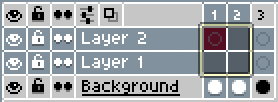

# Range

This class is used to represent the range of selected objects.

For example:



It can be:

* A list of layers
* A list of frames
* A list of cels
* A list of images
* A list of colors
* A list of slices

Or a combination of those.

## Range.type

```lua
local type = app.range.type
```

Returns a [RangeType](rangetype.md#rangetype).

## Range.isEmpty

```lua
local booleanResult = app.range.isEmpty
```

Returns true if the range is empty, i.e. there is no selected range in
the timeline (a thick border in the timeline), only the [active cel](app.md#appcel)
in the sprite editor.

This is the same as asking for `app.range.type == RangeType.EMPTY`.

Note that if the range is empty, you can still use
[Range.layers](#rangelayers) to get the [active
layer](app.md#applayer) (the Range.layers property will be an
array of one element, just the active layer). The same is true for
[Range.frame](#rangeframes) and [app.frame](app.md#appframe),
[Range.cel](#rangecels) and [app.cel](app.md#appcel), etc.

## Range.sprite

[Sprite](sprite.md#sprite) to which this range is pointing to.

## Range.layers

```lua
local layers = app.range.layers
app.range.layers = { layer1, layer2, ... }
```

Returns or sets the array of selected [layers](layer.md#layer).

## Range.frames

```lua
local frames = app.range.frames
app.range.frames = { 1, 2, ... }
```

Returns or sets the array of selected [frames](frame.md#frame).

## Range.cels

Returns an array of selected [cels](cel.md#cel).

## Range.images

Returns an array of selected [images](image.md#image) (images from linked
cels are counted just one time in this array).

## Range.editableImages

Returns an array of selected [images](image.md#image) in the range that are
in unlocked layers (editable).

## Range.colors

```lua
local selectedColors = app.range.colors
app.range.colors = { ... }
```

Gets or sets the array of selected palette entries in the [color bar](https://www.aseprite.org/docs/color-bar/).
Each element of the array is an integer (the palette index)

Example to select the colors with index 0 and 3 in the color bar:
```lua
app.range.colors = { 0, 3 }
```

## Range.tiles

```lua
local selectedTiles = app.range.tiles
app.range.tiles = { ... }
```

Gets or sets the array of selected tile entries in the [color bar](https://www.aseprite.org/docs/color-bar/)
when we are in a [tilemap layer](https://www.aseprite.org/docs/tilemap/).
Each element of the array is an integer (the tile index).

Example to select tiles with index 0 and 3 in the color bar:
```lua
app.range.tiles = { 0, 3 }
```

## Range.slices

```lua
local selectedSlices = app.range.slices
app.range.slices = { ... }
```

Gets or sets the array of [selected slices](https://www.aseprite.org/docs/slices) in the sprite editor.
Each element of the array is a [slice](slice.md#slice).

Example to select all slices in the sprite:
```lua
app.range.slices = app.sprite.slices
```

## Range:contains()

```lua
local hasLayer = app.range:contains(layer)
local hasFrame = app.range:contains(frame)
local hasCel = app.range:contains(cel)
local hasSlice = app.range:contains(slice)
```

Returns true if the given object
([layer](layer.md#layer)/[frame](frame.md#frame)/[cel](cel.md#cel)/[slice](slice.md#slice))
is inside the selected range.

## Range:containsColor()

```lua
local hasColor = app.range:containsColor(colorIndex)
```

Returns true if the given color index is selected in the [color bar](https://www.aseprite.org/docs/color-bar/).

## Range:clear()

```lua
app.range:clear()
```

Clears the current selected range of frames/layers/cels/colors.
