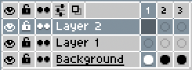
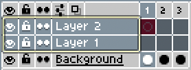
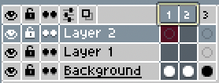

# RangeType

Type of [range](range.md#rangetype) selected in the timeline.

## RangeType.EMPTY

When there is no selection.

## RangeType.LAYERS

When the selection is in the layers.

## RangeType.FRAMES

When the selection is in the frames.

## RangeType.CELS

When the selection is in the cels.

